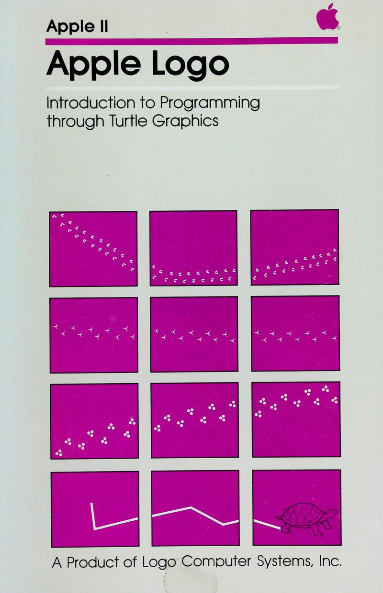

# Apple Logo

## Introduction to Programming through Turtle Graphics

[Download](./documents/Apple Logo.pdf)

This manual was published in 1982 to accompany the first release of
Apple Logo for the Apple II computer. Although I was the main author
of the work, Margaret Minsky was an essential editor. The entire Logo
Computer Systems development team was involved in the production. We
also had two incredible graphic designers, Judy Richland and Nancy
Gardner, working with us.

Our goal was to make a small attractive book. It had 18 short chapters
and an Appendix and Index.

----

[Back to Home Page](Home.md)
