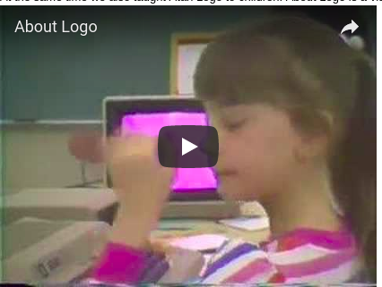
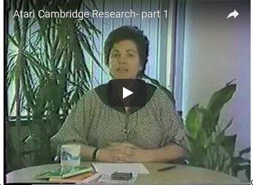
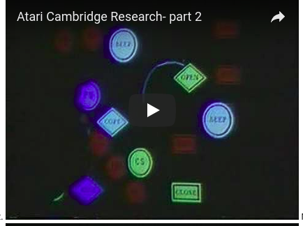
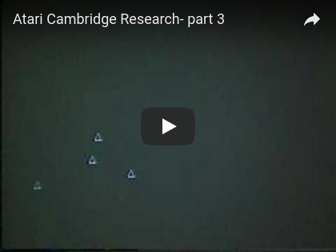
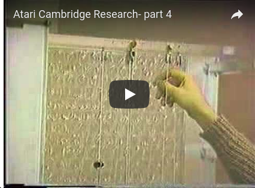
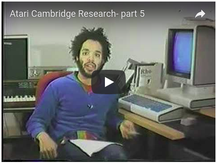
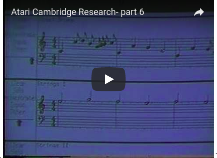
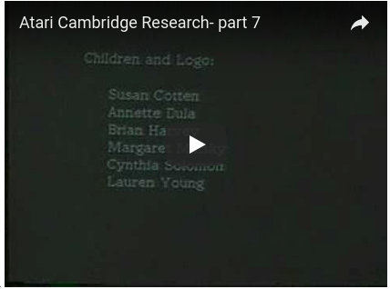
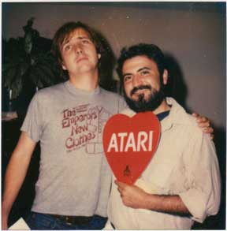
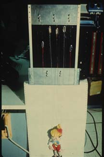

# Atari Cambridge Research

## Atari Cambridge Research 1982-84

In this very short lived lab a group of us, many of whom had been part
of the MIT AI Lab's Logo Group, imagined a children's playstation of
the future. Videos below show pieces of our work.

At the same time we also taught Atari Logo to children. About Logo is
a video of one such experience in a California school.

Just before the lab shut down we made a 25-minute video of our work. I
have divided that video into the following seven segments. (Notes on
Atari.)

Overview

Margaret on gesture

Ed on Gesture and Gary on object oriented Logo (Qlogo)

Mike on dance movement, Mark on puppetry, Max on force feedback.

David on music

Tom and Jim on music

Marvin's reflections

----

We had a lot of wonderfully talented and fun-loving people working
with us to build the children's playstation of the future. Here Greg
Gargarian holds an Atari sign as he shows Danny around the lab.

One project we tackled at Atari resulted in LogoWorks: Challenging
Programs in Logo, published by McGraw Hill (BYTE Books) in 1985. This
collection of Logo projects was edited by me, Margaret Minsky and
Brian Harvey. Many friends including Danny and Greg contributed
projects. logoworks.jpgAs it happens the book got published after
Atari was shut down and re-opened in a new identity.

In our (Twenty Things paper)[./documents/AIM-248.pdf] Seymour
describes a puppet machine.

It never worked but stood as a model and in 1982 Mark Gross built and
programmed a different puppet machine as can be seen on an Atari
video.
