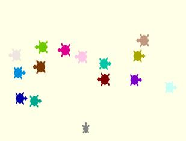
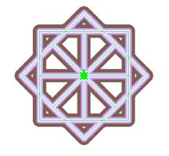
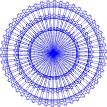
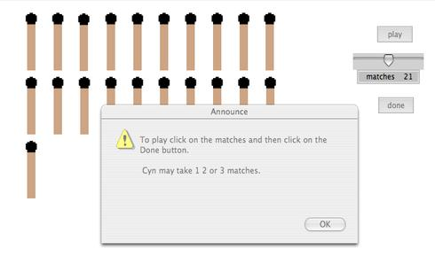
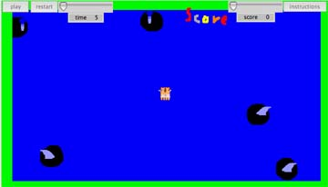

# Welcome, Logo Friends.

The programs written for these projects run in MicroWorlds EX (or EX
Robotics) and PyoLogo. But I hope I've written them so that they are
easily adapted for other versions of Logo.

Some of the programs were written in different versions of
Logo. Converting them has often been "hard fun".

I've used text, graphics and video in the explanations. I plan on
adding more projects and welcome contributions from you.  --Cynthia
Solomon

##  Projects

* 
* 
* 
* 
* 
* 
* 
* 
* 
* 
* 
* 
* 
* 
* 
* 
* 
* 
* 
* 

----

Click on the pictures to see more details or select from the menu.

Frogger

How can you make this turtle design better?

What basic structure did the turtle use to make this design?

How did the turtle make this?

How do you get a group of turtles to be evenly spaced about the rim of a circle?

Would you attend the Shed School?

Let's play Nim.

How do you design and set up your own game?

Regular Polygons
