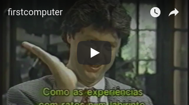

# Marvin Minsky Speaks

## Marvin Interviewed in 1995

In 1995 Marvin was interviewed by [Paul
Hoffman](https://lsc.org/about-us/executive-staff) for Discover's TV
program [Discovering Great Minds of
Science](https://www.amazon.com/Best-Great-Minds-Science-VHS/dp/157523453X). The
interview was about 40 minutes. I have extracted short clips and
posted them here.

Paul Hoffman asks Marvin if he built machines as a child. He talks
about Tinkertoys.

Marvin tells about a gift from his father that made a huge difference
in his childhood.

Marvin talks about how computer science opens up thinking about thinking.

Paul Hoffman asks Marvin about the first computer he built.

Marvin points to an education problem.

Eric Solomon talks with Marvin.

----

[Back to Home Page](Home.md)
