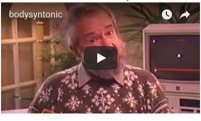
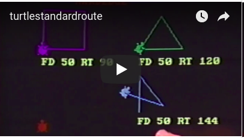
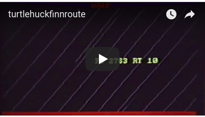

# An Introduction to Logo and Turtle Geometry

This is a glimpse of Seymour introducing Logo and Turtle Geometry. The
videos were taken from Seymour Papert on Logo a video series made by
William and Elizabeth Schwartz, Ladue, Missouri.

Although these videos were made in 1986 it could have been 1970 or
today.

----

Terms of Use:

The On Logo and On LogoWriter videos are copyright Media Microworlds
Inc. They are being made available here on the Logo Foundation website
for personal and educational use only. Credits on the videos must
remain, as originally configured. No fees may be charged for
viewing. No advertisements may be attached to or superimposed on the
video content without further permission.