# The70s

## 1969 The Start of the Logo Group at the MIT AI Lab

The yellow floor turtle pictured here was a large cannister on wheels.

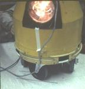

Found in government junk yard in Taunton, Ma where there was a DOD
stockpile of unwanted objects. This place was open monthly to DOD
grantees. Marvin loved to find used equipment out of which he could
build new things. When he spotted this canister he thought of turning
it into a floor turtle. Marvin led the way and with help from lab
engineers and machinists a turtle was born. It was designed to have
touch sensors but they were too unreliable to use. It did, of course,
have a pen in the middle of its underside and it could be put up or
down and so the turtle could leave a trace of its path.

There was a small turtle in the works at BBN and also at the AI Lab,
but the yellow turtle happened and worked! Seymour had asked Mike
Patterson who spent 3 years at the AI Lab as an assistant professor
before going back to University of Warwick to think about turtle
behavior and turtle language.

If we wanted to use turtles with kids in a school (remotely) several
problems had to be solved. The floor turtles had to be tethered, that
is, attached to a terminal which was attached to a time-shared
computer. The display turtle had a different set of problems. This was
1969-70. The display had to be refreshed. Seymour’s solution was to
borrow a small computer from the Applied Math Department and have it
drive a display. Hal Abelson, then a graduate student, was charged
with figuring out how to do it. Nat Goodman an undergraduate worked
with Hal in executing this task.

By the 1970-71 school year we had a floor turtle and a display
turtle. Later in the year a small round plastic floor turtle joined
the yellow one. These turtles had to be attached to a terminal. Thus
sharing the turtle was an important aspect.  The display turtle was
designed to let users at four different terminals alternately take
control of the turtle.  Thus by 1970 we had a computer environment for
kids that included:

* A programming language designed specifically for children
* A way to write stories
* A way to draw with a programmable object
* A way to have the programmable object explore an environment
* A way to make and play music

This system was in play for the 1970-71 and 1971-72 school years at
the Bridge School in Lexington, MA.

By summer 1972 Ron Lebel led the development of a new Logo and AI Lab
staff member, John Roe, built “portable” turtle graphics terminals
running on a DEC PDP-11.

In the mid 1970s Marvin Minsky designed a commercially available
portable turtle graphics station.  By the late 1970s Texas Instruments
had commissioned Seymour to build a Logo for the yet to be finished TI
9900. This small single user computer contained a sprite board and
thus 28 turtles could exist at the same time.  A Logo for the Apple II
was also created.

## Logo, Turtles, Music and Kids

In 1970-71, the next year long Logo class that Seymour and I
collaborated on was with 5th graders at the Bridge School in
Lexington, MA. The Logo Group was formed as part of the MIT AI Lab and
both floor and display turtles existed.

Intermixed with debugging their Logo programs we encouraged children
to apply procedural thinking and debugging to developing physical
skills as well.  Here is Seymour (circa 1970-1) on a bongo board with
me poking him periodically. This video was given to me by Hal Abelson.

[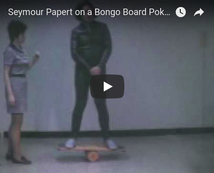](https://youtu.be/Urn4y5kmtuU)

The next video is of the Yellow Turtle built at the MIT AI Lab and
programmed by children in the 1970s. (A display turtle was working on
the AI Lab's PDP-10; it was driven by a PDP-6. I am looking for film
clips of turtle behavior on this display screen.)

[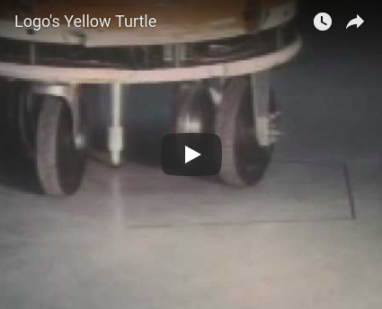](https://youtu.be/KeFhFPNO8hc)

The next video shows what Logo programming looked like in 1970.

[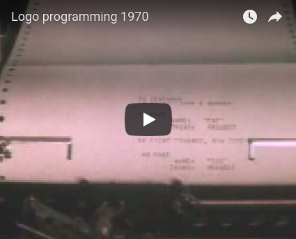](https://youtu.be/e9vQSZvSABY)

## 1970-1971 Logo, Turtles, Music, and Children

In 1971 Channel 5, a local Boston TV station, produced a program on
children in new learning situations and included a segment on
Logo. Here is that segment. My one regret is that Seymour was not
talking with a child during the filming.

[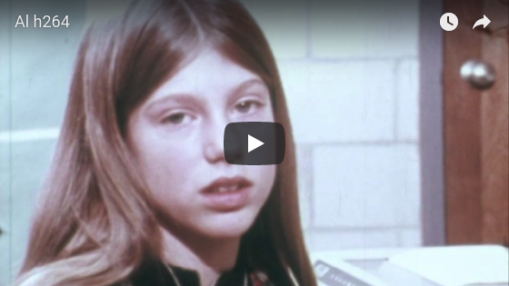](https://youtu.be/maDzjHIiXZc)

My the way Marvin Minsky built the four-voice music box the children
used in the video.

## The Exeter Congress 1972

In August of 1972 a math education conference was held in England at
the University of Exeter. At MIT the Logo Group was just finishing a
new version of Logo running on a DEC PDP-11 with its own time-sharing
environment. Ron Lebel was the chief programmer with lots of advice
from Hal Abelson and Tom Knight and others. Attached to the computer
were turtle graphics terminals built by Ron and inspired by Tom
Knight's graphics stations for the AI Lab's PDP-10.

Digital Equipment Corp. had coincidentally sold a PDP-11 computer to
the University of Exeter. So a light went off in Seymour's head
connecting the conference and the sale. The result was that several of
us went to Exeter England at the beginning of August in preparation
for the conference at the end of August. DEC transported a PDP-11 and
all our peripheral equipment. I arranged to work with 10, 11, and 12
year olds prior to the conference. We had 4 display turtle stations, 1
floor turtle, and 1 4-voice music box. The crew consisted of Hal
Abelson, Tom Knight, Ron Lebel, Margaret Minsky, and me. Jeanne
Bamberger was there a week before the conference. Seymour came in time
for the conference. Some of us brought family members.I brought my 12
year old nephew, Erric. He and some other 12 year olds took over
computer management during the conference. (They put out a small fire
while we adults were at dinner.)

After the Exeter experience Seymour, Mavin, Alan Papert, me and a
couple of others started General Turtle, a company to make floor
turtles.  Marvin, Alan and students including Danny Hillis and
Margaret Minsky designed and built a Logo turtle graphics machine. It
was marvelous but came about on the edge of the personal computer
revolution and was priced out of the home and school market.

Here Marvin shows the 2500.

[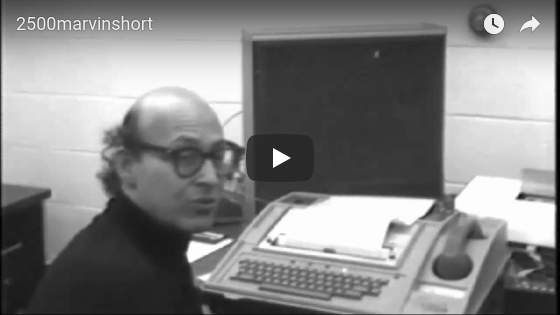](https://youtu.be/c4kMzrDr4jQ)

Marvin introduces Seymour to talk about the language.

[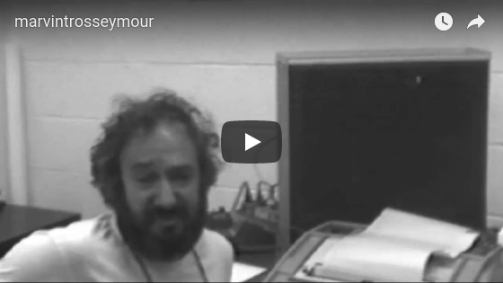](https://youtu.be/-W4zaMGQx9w)

Brian Silverman brought the 2500 graphics back to life
[here](http://www.playfulinvention.com/demos/MinskyLogo/), with a
little bit of
[documentation](http://www.playfulinvention.com/demos/MinskyLogo/description.txt).

The 2500 was used with children taught by Dan Watt in the Lincoln
Elementary School, Brookline, MA.

## The First Year-Long Class

Our first full year Logo class was in 1968-69 with seventh graders at
Muzzey Junior High School. We were at BBN at the time. In the fall of
1969 I became a member of the AI Lab and we started our Logo work
there.  The first graphics turtle and a floor turtle were built and
running by 1970. The graphics turtle was not portable. Its display was
driven by a Digital PDP-6 connected to a Logo running on the lab's
PDP-10. First programs were written by Bill Gosper and other lab
hackers. The yellow turtle was assembled by Tom Callahan.

In preparation for using turtle graphics with kids Seymour began
planning a portable system. This is when Hal Abelson joined the
group. He started the design and worked with Nat Goodman on getting
the software to work.  Marvin designed and built a four voice music
box for us. It was housed in a small black translucent plastic box.

## Pictures from the Bridge School in Lexington, MA -- 1970-2

We were given 2 small rooms with a large window between them. The
graphics turtle ran on a display powered by a Data General
computer. The children used Logo over phone lines to a time-shared
Digital PDP-10 back at the MIT AI Lab.

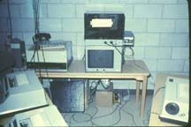

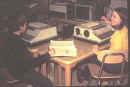

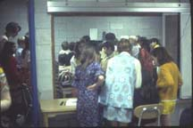

## 5th graders with our first turtle.

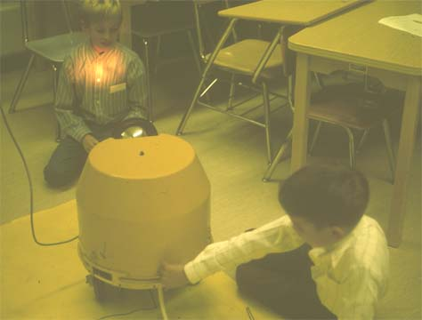

Seymour in the classroom

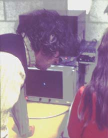

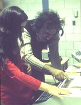

Me with kids.

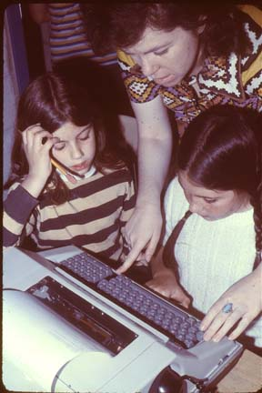

## Teaching Assistants

Kiyoko Okumura, Rich Fryberg and Bob Mohl

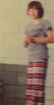

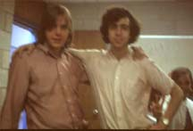

## Turtle Graphics Ramblings

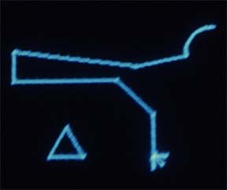

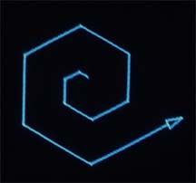

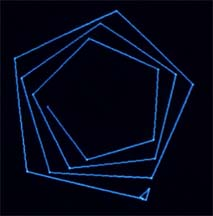

## Our second turtle

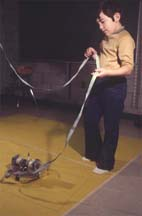

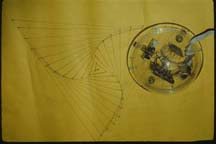

## Work with Young Children

Radia Perlman's Button Box for Pre-Schoolers

## Me with First Graders in 1971-2

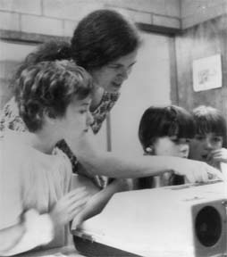

## 1972 Logo Re-implementation

In time for an international math education conference held at the
university in Exeter, England, Ron Lebel had led the implementation of
Logo on a dedicated time-shared DEC PDP-11. This time shared system
included "portable" turtle graphics stations based on Tom Knight's
display stations running on the AI Lab's PDP-10. Hal and Nat were
involved in the graphics. The language revisions were major and were
based on feedback from work with children. DEC helped us in shipping
equipment and setting up in Exeter four weeks before the
converence. The computer would stay at the university but the graphics
stations (5), floor turtle, and music box were returned to MIT at the
end of the conference. Several of us went over with the computer. The
group included Ron Lebel, Tom Knight, Hal Abelson, Margaret Minsky,
Erric Solomon and me. I went to work with 9, 10, 11 and 12 year old
Exeter children. Margaret, a high schooler, was my teaching assistant
and Erric, a middle schooler, joined the Exeter children. Jean
Bamberger came over later to use the music box with the
children. Seymour.also arrived a few days before the conference. We
were given a large room in close proximity to the conference rooms.

The kids became teachers to the math educators attending the
conference. The kids were incredible. Rumors spread such as Seymour
could teach anybody anything. When it was discovered that I did the
teaching, the rumors changed to we bribed the kids with candy.

## General Turtle

Something else happened that summer. Marvin, Seymour, and I along with
Russell Noftsker and Seymour's brother Alan planned to make turtles
available through a new company called General Turtle.

Later that year Marvin began designing a "portable" turtle graphics
Logo station known as the 2500.

During the decade of the 70's Logo went through several re-designs and
re-implementations and new classroom teachings. There were three major
projects that took place: the Brookline Project at the Lincoln School
where Dan Watt taught the Logo classes; the Lamplighter School in
Texas where TI Logo was tested out, and the Hennegan School project in
Boston. There was also the wonderful work of Jose Valente (also Sylvia
Weir and her team, Ann and Sue )with physically challenged and
learning disabled students at the Cotting School. Also, during the 70s
Howard Austen made a study of juggling as his doctoral work. This
circus art Seymour and I taught children as an example of
recursion. We also included bongo boarding and unicycling. (Seymour
tried balancing on a circus ball.) In the later 70s a group of MIT
students became part of the Logo Group. This included Margaret Minsky,
Danny Hillis, Gary Drescher, Jim Davis, Ed Hardebeck, Brian Silverman,
Max Behensky and more. They were housemates.

## TI Logo

One of the founders of Texas Instruments, an MIT graduate, tapped
Seymour to make a Logo for the TI "micro" computer under
development. The new machine introduced the sprite hardware allowing
for multiple turtles. Ed and Gary were deeply involved in this
implementation with help from the others.

Celebrating TI Logo in 1981

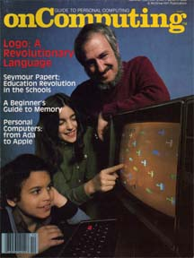

## TI Sprite Logo 1978-9

Seymour was approached by Texas Instruments founder Cecil Green. Green
had a grandchild in the Lamplighter School in Dallas. He wanted Logo
on the new personal computers TI was building. Ed Hardebeck became the
chief implementer of Sprite Logo -- color and sprites (turtles).

In 1980 Marvin, Seymour, me and a couple of Canadians started Logo
Computer Systems.

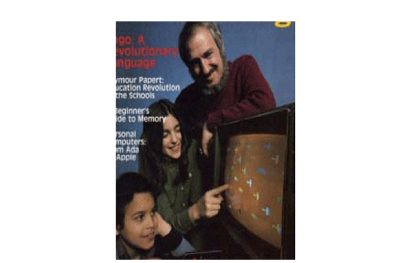
