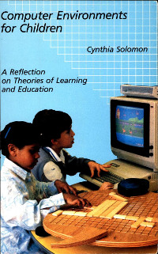
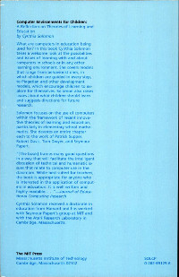

# Computing Environments for Children

A Reflection on Theories of Learning and Education

by Cynthia Solomon

[Summary](Summary.md)

## Contents

[Front Matter](http://www.scribd.com/doc/53491653/Front)

[Table of Contents](http://www.scribd.com/doc/53491657/toc-ack)

1. [Introduction](http://www.scribd.com/doc/53491255/1-Computers)

2. [Suppes](http://www.scribd.com/doc/53491293/2-Suppes): Drill and Practive and Rote Learning

3. [Davis](http://www.scribd.com/doc/53491337/3-Davis): Socractic Interactions and Discovery Learning

4. [Dwyer](http://www.scribd.com/doc/53491406/4-Dwyer): Eclecticism and Heuristic Learning

5. [Papert](http://www.scribd.com/doc/53491545/5-Papert): Constructivism and Piagetian Learning

6. [Trends in Practice](http://www.scribd.com/doc/53491560/6-Trends)

7. [Computer Educators](http://www.scribd.com/doc/53491588/7-Educators)

[Bibliography and Index](http://www.scribd.com/doc/53491647/Bib-Index)

----

[Back to Books and Papers](../Books.md)

[Back to Home Page](../Home.md)
