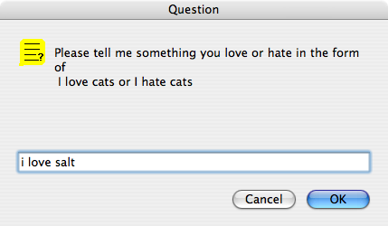
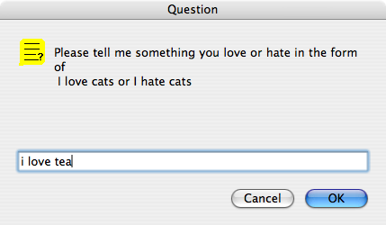
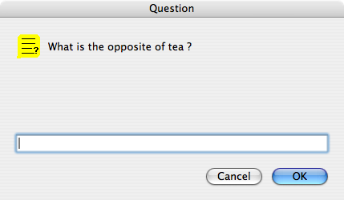
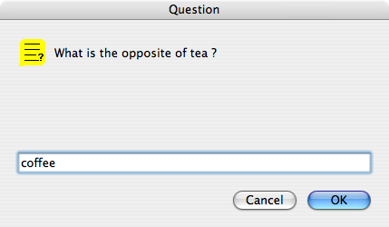
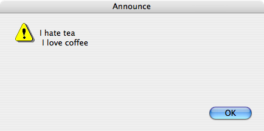

# Argue

## History

The program, by Danny Hillis and the write-up by Margaret Minsky, was
one of a collection of projects from [LogoWorks:Challenging Programs
in Logo](https://logothings.wikispaces.com/More%20on%20Atari). The
book edited by Margaret Minsky, Brian Harvey and me was published in
1985 after the demise of Atari Cambridge Research. The programs ran in
[Atari
Logo](https://logothings.wikispaces.com/Atari%20Cambridge%20Research). I
have adapted Argue to run in PyoLogo and also updated the write-up.

## Argue argues

Argue carries on a dialogue with you. When you run argue, it expects
you to type a statement in the form `I LOVE LEMONS` or `I HATE
DOGS`. Argue comes back with contrary statements. For example, if you
make the statement `I HATE DOGS`, the program types

<pre>
I LOVE DOGS
I HATE CATS
</pre>

If it doesn’t already know the opposite of a word, it asks you. For
example, if you type `I LOVE LEMONS` and argue does not know the
opposite of `LEMONS`, it types `WHAT IS THE OPPOSITE OF LEMONS?`

If you tell it `ORANGES`, it will type

<pre>
I HATE LEMONS
I LOVE ORANGES
</pre>

Here is a sample

## Argue Can Reply to Your Statements

When you run `argue`, it types out a question and waits for you to
respond. It then calls `arguewith`. `arguewith` is given your
statement. `argue` is recursive so this process continues.

<pre>
to argue
question (se [Please tell me something you love or hate in the form of] char 13 [I love cats or I hate cats])
arguewith parse answer
argue
end
</pre>

`arguewith` prints two responses to your statement, First, it turns
around your statement; if you say that you love something, `arguewith`
says that it hates it, and if you say you hate something, `arguewith`
says that it loves it, Second, it makes a statement about the opposite
of the object you mentioned.

<pre>
to arguewith :statement
announce (se "I love.hate second :statement last :statement char 13
"I second :statement opposite last :statement
end
</pre>

The procedure `love.hate` sees whether its input is `"love` or `"hate`
and outputs the other one.

<pre>
to love.hate :word
if :word = "love [op "hate]
if :word = "hate [op "love]
end
</pre>

The arguewth procedure works only with statements in the form I LOVE
something or `I HATE` something because it assumes that the second word
in your statement is `LOVE` or `HATE` and that the last word in your
statement is something whose opposite can be found.

`arguewith` uses `second` to grab the second word in a sentence.

<pre>
to second :list
op first bf :list
end
</pre>

The `opposite` procedure is the real guts of the `argue` program. It
takes a word as its input and outputs the opposite of that word. And
if it can’t find the opposite it asks you for it. Then `arguewith` can
print out the computer’s point of view.

<pre>
to opposite :object
if name? :object [op thing :object]
question (se [What is the opposite of] :object "? )
learnopp :object answer
op thing :object
end
</pre>

# The Program Keeps Track of Opposites

How does the program know that pepper is the opposite of salt?
Somehow, the argue program has to have this information stored. We use
variables to hold this information. For example, `:salt` is `pepper`,
`:cats` is `dogs`. This is how we have chosen to store the facts the
program “knows.” We call this a data base. You can look at the
database for the argue program by looking at all the variables in the
workspace. Try:

<pre>
show names
make "dogs "cats
make "cats "dogs
make "light "dark
make "dark "light
make "sunrises "sunsets
make "sunsets "sunrises
make "crying "laughing
make "laughing "crying
make "pepper "salt
make "salt "pepper
make "lobsters "crabs
make "crabs "lobsters
</pre>

These variables are loaded into the workspace with the `argue`
program. (If you type in the procedures and there are no variables in
the workspace argue will create these variables when it asks you for
the opposite of things.)

To find out the opposite of something, for example `dark`, we can say

<pre>
show :dark
light
</pre>

or

<pre>
show thing “dark
light
</pre>

What if we want to find out the opposite of light? There is no easy
way to find out it is dark unless we have another variable named
light, with the value dark. So we can say

<pre>
show thing “light
dark
</pre>

We have set up a convention in our database to always put in both
parts of a pair. That way, we don’t end up in the funny situation
where it is easy to find out that the opposite of rough is smooth, but
impossible to find out what the opposite of smooth is. Our mental
concept of opposite is that it “goes both ways” so we make our
database reflect that.

# How the `opposite` procedure works

With this kind of database we can write a procedure to output the
opposite of something. Here is a possible first version of `opposite`.

<pre>
to opposite :object
op thing :object
end
</pre>

This is a good example of needing to use thing rather than dots
(`:`). The word of which opposite is trying to find the value is
whatever `:object` is. For example, if `:object` is the word `salt`, then
the program is trying to find `:salt`. It must do this indirectly by
using thing `:object`.

This first version of `opposite` has a problem. It only works for
words that are already in the database. If you make a statement like `I
LOVE SUNSETS` and there is no variable named `sunsets`, then the `opposite`
procedure will get an error. To solve this problem, we use `name?` to
check for the existence of a variable named by `:object`. In this
example `:object` is the word `sunsets`; the program checks whether there
is already a variable named `sunsets`. If there isn’t, `opposite` stops
what it’s doing and asks you for the opposite word and enters it in
the database.

<pre>
to opposite :object
if name? :object [op thing :object]
question (se [What is the opposite of] :object "? )
learnopp :object answer
op thing :object
end

to learnopp :object :opp
make :object :opp
make :opp :object
end
</pre>

To do this job `opposite` calls on `learnopp`. After the user types
the opposite, `opposite` passes both the problem word and its opposite
to `learnopp`, which puts that pair of words in the database. Then the
argument about sunsets can continue. `opposite` calls `learnopp`
whenever it needs to.

## Now argue Can Argue Pretty Well

So argue can keep going as it adds new words to its database.

`argue` responds:

and so on.

If we look at the database after this, we can see what has been added.

<pre>
show names
make "sunrises "sunsets
make "sunsets "sunrises
make "tea "coffee
make "coffee "tea
</pre>

In order for the program to “remember” this database, the workspace
with these variables must be saved on disk or some permanent place.

## Suggestions

The `argue` program assumes that the sentences you type in are going
to be exactly in the form

`I love something`

or

`I HATE something`

If they are not, an error occurs and the program stops. You could
improve the program so that it checks for the right kinds of sentences
and asks you to retype them if there are problems.

Maybe it could know about more emotion words such as desire, like,
dislike, despise, detest.

If you try:
`I LOVE GREEN PEAS`
the program will say:

`I HATE PEAS`

and ask you for the opposite of peas. It will ignore the green. You
might make a better arguing program that tries to figure out if there
is an adjective and finds its opposite.

<pre>
I HATE GREEN PEAS
I LOVE RED PEAS
</pre>

`argue` doesn’t have any mechanism for dealing with single objects
described by more than one word, like `ICE CREAM`. Perhaps a special
way to type these in might be added.

# Program Listing

<pre>
to argue
question (se [Please tell me something you love or hate in the form of] char 13 [I love cats or I hate cats])
arguewith parse answer
argue
end

to arguewith :statement
announce (se "I love.hate second :statement last :statement char 13
"I second :statement opposite last :statement
end

to love.hate :word
if :word = "love [op "hate]
if :word = "hate [op "love]
end

to second :list
op first bf :list
end

to opposite :object
if name? :object [op thing :object]
question (se [What is the opposite of] :object "? )
learnopp :object answer
op thing :object
end

to learnopp :object :opp
make :object :opp
make :opp :object
end

make "dogs "cats
make "cats "dogs
make "light "dark
make "dark "light
make "sunrises "sunsets
make "sunsets "sunrises
make "crying "laughing
make "laughing "crying

make "pepper "salt
make "salt "pepper
make "lobsters "crabs

make "crabs "lobsters
make "tea "coffee
make "coffee "tea
</pre>

----
[Back to Logo Projects](../LogoProjects.md)

