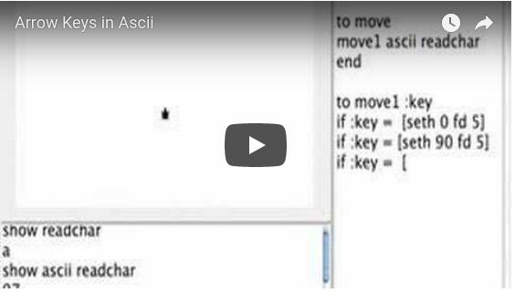

# Arrow.Keys

Using Arrow Keys to Control a Turtle

If you are in a hurry, just copy the procedures and paste them into
your Logo. Then remember to run the move procedure forever.

Make a turtle button, a procedure or just type the following into the
command center:

<pre>
forever [t1, move]
</pre>

Don't forget to talk to the turtle you want to control.

## On Macs

<pre>
to move
move1 ascii readchar
end
to move1 :key
if :key = 28 [seth 270 fd 5]
if :key = 29 [seth 90 fd 5]
if :key = 30 [seth 0 fd 5]
if :key = 31 [seth 180 fd 5]
end
</pre>

## On PCs

<pre>
to move
move1 ascii readchar
end

to move1 :key
if :key = 37 [seth 270 fd 5]
if :key = 39 [seth 90 fd 5]
if :key = 38 [seth 0 fd 5]
if :key = 40 [seth 180 fd 5]
end
</pre>

If you want to add more keys to `move1`, you have to find their ASCII
code.  The Standard ASCII code contains 128 numbers from 0 to
127. These are the same on MACs or PCs. For example on either system
`ascii "A` is `65` and `ascii "a` is `97`.

Another 128 characters make up the Extended ASCII code. This set usually
differs on Macs and PCs. The arrow keys belong to this extended set.
Finally for Logo to accept non-printing characters readchar is needed.
The following instruction will let you find ASCII codes.

<pre>
show ascii readchar
</pre>

By the way, char will let you find what the ASCII number represents.

<pre>
show char 97
a
</pre>