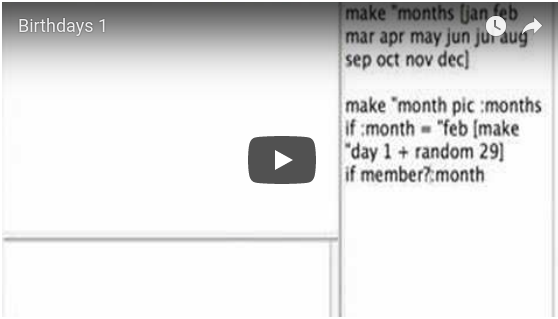
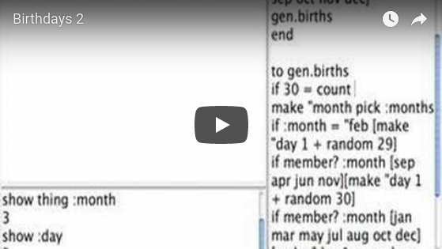
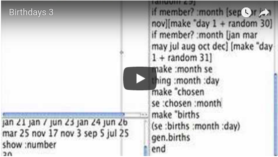
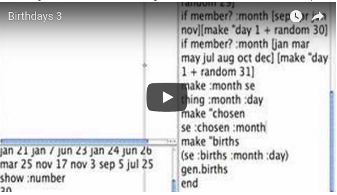
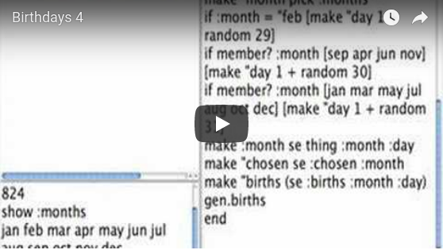
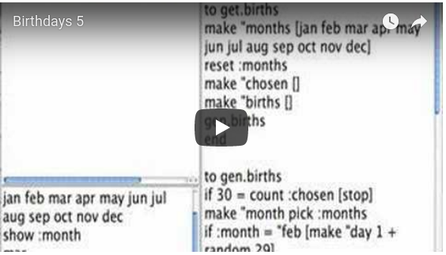
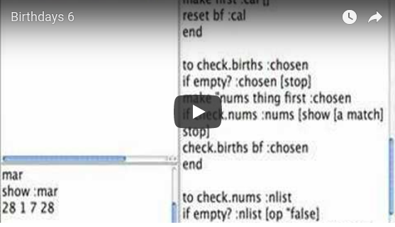

# Birthday Party

What's the likelihood that two people in a crowd will have the same birthday?

Does it matter in what month you were born?

Does it matter how big or small the crowd is?

I didn't understand the problem. I thought there were magic
numbers. So what I did was write a program to solve the problem as I
understood it.

So this is about how I got the computer to randomly select a specific
number of birthdays, then check to see if there was a match. As I
tested one component another idea would pop up until finally I got a
working program.

## Generating Random Dates

<pre>
to get.births
make "months [jan feb mar apr may jun jul aug sep oct nov dec]
gen.births
end

to gen.births
make "month pic :months
if :month = "feb [make "day 1 + random 29]
if member? :month [sep apr jun nov][make "day 1 + random 30]
if member? :month [jan mar may jul aug oct dec] [make "day 1 + random 31]
make :month se thing :month :day
gen.births
end
</pre>

There's a typing bug. The word `pic` is not correct; it needs to be `pick`.

Below is an example of what happens when I run `get.births` and then
look at the variables.

<pre>
get.births
show :month
oct
show :day
4
show thing :month
4
show :oct
4
</pre>

<pre>
to get.births
make "months [jan feb mar apr may jun jul aug sep oct nov dec]
make "number 0
make "births []
gen.births
end

to gen.births
if 30 = :number [stop]
make "month pick :months
if :month = "feb [make "day 1 + random 29]
if member? :month [sep apr jun nov][make "day 1 + random 30]
if member? :month [jan mar may jul aug oct dec] [make "day 1 + random 31]
make :month se thing :month :day
make "number :number + 1
make "births (se :births :month :day)
gen.births
end
</pre<

And after running get.births, here is an example of what the variables contain.

<pre>
show :number
30
</pre>

<pre>
show :births
jun 10 dec 3 mar 21 feb 5 jan 20 may 12 sep 24 dec 9 apr 16 mar 4 jul 19 jun 11 apr 26 apr 10 jan 14 oct 20 jul 29 oct 29 dec 12 nov 27 feb 25 nov 6 nov 29 apr 5 sep 7 may 5 mar 5 jan 13 aug 8 jul 24
</pre>

After looking this over I see some more changes need to be made. We
need to collect the picked months and we can get the number of them by
using count.

<pre>
to get.births
make "months [jan feb mar apr may jun jul aug sep oct nov dec]
make "chosen []
make "births []
gen.births
end

to gen.births
if 30 = count :chosen [stop]
make "month pick :months
if :month = "feb [make "day 1 + random 29]
if member? :month [sep apr jun nov][make "day 1 + random 30]
if member? :month [jan mar may jul aug oct dec] [make "day 1 + random 31]
make :month se thing :month :day
make "chosen se :chosen :month
make "births (se :births :month :day)
gen.births
end
</pre>

This works sort of. The big bug is that `:oct` or `:sep` needs to be
reset to empty after each running of `get.birth`.

The following procedure will do that:

<pre>
to reset :cal
if :cal = [][stop]
make first :cal []
reset bf :cal
end
</pre>

Now we have procedures that will generate 30 random dates. The next
thing we need to do is check to see if there are two dates that are
the same.

## Checking the Birthdays for a Duplicate

Let's find out if there are two birthdays on the same date.

The job is to look at each month and see if its list of days has two
that are the same.

Here is listing of the procedures we have so far:

<pre>
to get.births
make "months [jan feb mar apr may jun jul aug sep oct nov dec]
reset :months
make "chosen []
make "births []
gen.births
check.births :months
end

to gen.births
if 30 = count :chosen [stop]
make "month pick :months
if :month = "feb [make "day 1 + random 29]
if member? :month [sep apr jun nov][make "day 1 + random 30]
if member? :month [jan mar may jul aug oct dec] [make "day 1 + random 31]
make :month se thing :month :day
make "chosen se :chosen :month
make "births (se :births :month :day)
gen.births
end

to reset :cal
if empty? :cal [stop]
make first :cal []
reset bf :cal
end

to check.births :chosen
if empty? :chosen [stop]
make "nums thing first :chosen
if check.nums :nums [show (se first :chosen :nums [a match]) stop]
check.births bf :chosen
end

to check.nums :nlist
if empty? :nlist [op "false]
if member? first :nlist bf :nlist [op "true]
op check.nums bf :nlist
end
</pre>

## The final program:

The final version of the birthday program, let's you run batches of
birthday groups of different sizes. The superprocedure, `test.births`,
takes two inputs, the number of times to run `gen.births` and the size
of the group for the birthday search. In the process the data is
collected in the variables, `janh`, `febh`, etc. and printed at the end.

</pre>
to test.births :times :groupsize
make "matches 0
make "history [janh febh marh aprh mayh junh julh augh seph octh novh dech]
zap :history
repeat :times [gen.births]
show :matches
show printout :history
end

to gen.births
make "births []
make "months [jan feb mar apr may jun jul aug sep oct nov dec]
reset :months
get.births
check.births :months
end

to get.births
if :groupsize = count :chosen [stop]
make "month pick :months
if :month = "feb [make :month se thing :month 1 + random 29 ]
if member? :month[apr sep jun nov][make :month se thing :month 1 + random 30]
if member? :month [jan mar may jul aug oct dec] [make :month se thing :month 1 + random 31]
make "births se :births se :month last thing :month
make "chosen se :chosen :month
get.births
end

to reset :cal
if :cal = [][stop]
make first :cal []
reset bf :cal
end

to zap :cal
if :cal = [][stop]
make first :cal 0
zap bf :cal
end

to check.births :chosen
if empty? :chosen [stop ]
make "nums thing first :chosen
make "hmonth word first :chosen "h
if check.nums :nums [make "matches :matches + 1 make :hmonth 1 + thing :hmonth stop]
check.births bf :chosen
end

to check.nums :nlist
if empty? :listofnums [op "false]
if member? first :nlist bf :nlist [ op "true ]
op check.nums bf :nlist
end

to printout :hist
if empty? :hist [op []]
op se se bl first :hist thing first :hist printout bf :hist
end
</pre>
