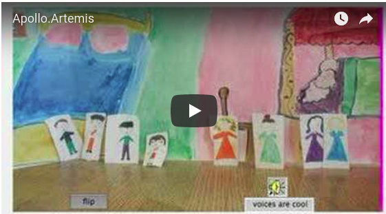
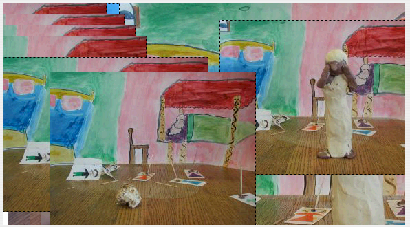
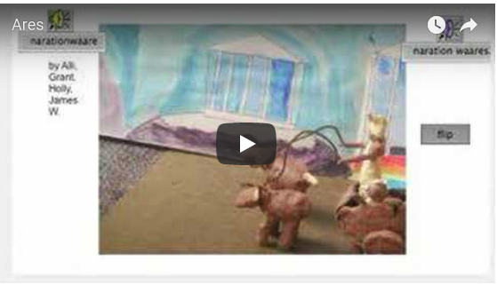
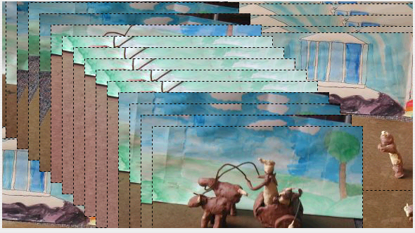
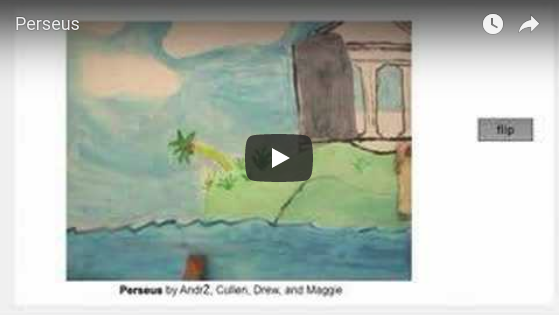
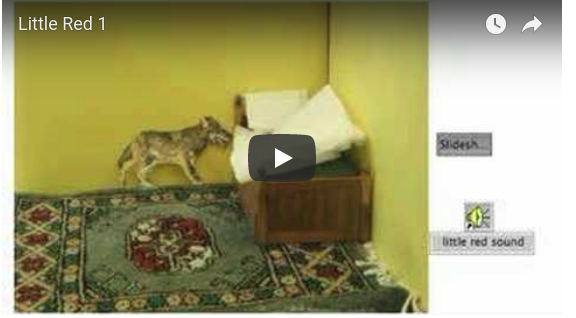
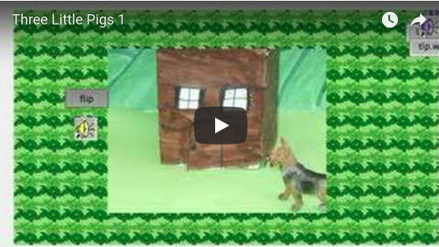
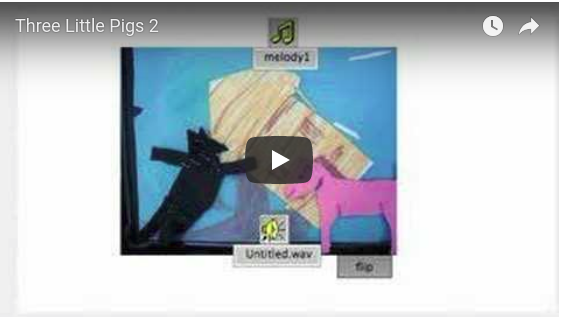

# Claymation Examples

## Examples of Claymation Movies

These examples were created by fifth and sixth graders. These fifth
graders were studying about Ancient Greece. Their art teacher, social
studies teacher and I, their computer teacher, merged our
activities. The children worked in teams of four and chose a Greek
myth for which they made clay figures. Using still frame animation the
groups made movies.

## Apollo and Artemis

)

For this project the students took 24 camera shots which were turned
into turtle costumes.

## Ares

This project has 52 camera shots.

## Perseus

This project was made with 128 camera shots.

## Sixth Graders and Fairy Tales

The fifth graders did wonderfully, but it was very hard fun and took
several weeks. I decided to ask the sixth graders to make stop motion
animation as in claymation but to use already made pieces. Student
groups of about four people decided on a fairy tale and gathered
objects they had at home.

Little Red Ridinghood version 1

Little Red Ridinghood version 2

The Three Little Pigs 1

The Three Little Pigs version 2

----
[Back to Logo Projects](../LogoProjects.md)