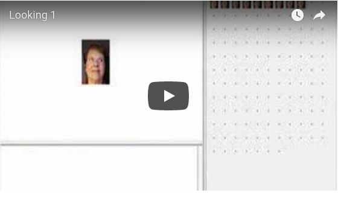
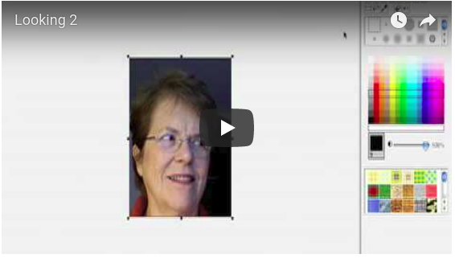

# Making Faces

In this project I use pictures of my face as turtle costumes. This
idea come from someone else. I was working with a friend when he
decided to take my picture as I looked in different directions. I
didn't know what he had in mind. After a few days they showed me what
they had done. My pictures became costumes for the turtle showing its
direction. I couldn't stop laughing!

Now that my computer has a camera I thought it would be fun to make my
own version. It was harder and took more time than I expected. One of
the hardest things was taking the pictures!

In the following video clip the pictures are ready for use. I decided
to use four of the pictures as costumes for the turtle as I controlled
it from the arrow keys (See [Arrow Keys](ArrowKeys.md)).

On the video clip I keep saying I had to organize the pictures. In
fact, I didn't have to do such a thing. It does look nicer but I
didn't have to do it.

----
[Back to Logo Projects](../LogoProjects.md)
