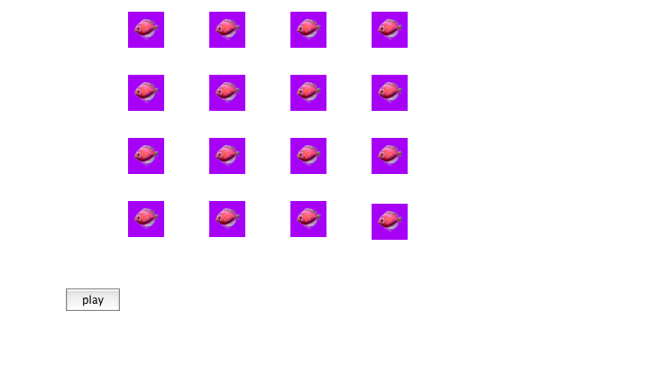
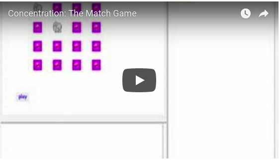
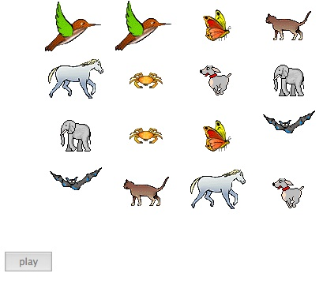

# Matching Game

## Concentration, A Matching Game

A number of cards are displayed; they all look the same. Your job is
to uncover matching pairs of pictures as quickly as possible. When you
click on a card its picture is exposed. The computer waits for you to
click on a second card and then turns that one over. If the two
pictures match they are left exposed. If they do not match the cards
are covered over. In this version of the game your performance is not
timed nor are the clicks counted, but you could certainly add such
capabilities later.

As you can see from the images above the game is made up of sixteen
turtles aligned in a four by four grid. You could of course design a
different layout, but that’s for a future discussion. The layout was
not a problem in the beginning. I just placed the turtles in the
screen positions by hand. The problems I had to face were how to

* Pair up the turtles
* Assign a shape to each pair
* Cover and uncover a turtle’s shape
* Allow only two turtles to show their shapes at any one time

Pairing up turtles and giving the pair unique shapes

To handle these actions I made a list of variables representing each
turtle. For this version I needed sixteen turtles. I put sixteen
variables in a list and named a list called “t. Notice that the
variable names were similar to the actual turtle names except that I
added the word, s, to the names.

`make "t [st1 st2 st3 st4 st5 st6 st7 st8 st9 st10 st11 st12 st13 st14 st15 st16]`

I needed at least eight shapes since there were eight pairs. I started
putting the shapes in the shape table. I could have chosen any
starting place or scattered them about, but I chose to start at 6 and
go through cell 13.

`make “costumes [6 7 8 9 10 11 12 13]`

<pre>
to setup.turtles
make “costumes [6 7 8 9 10 11 12 13]
make "t [st1 st2 st3 st4 st5 st6 st7 st8 st9 st10 st11 st12 st13 st14 st15 st16]
male "pairs 0
setforplay
end
</pre>

I also needed a cover shape and I put it in cell 1, but we will do it later.

## Randomly choosing and Assigning Shapes to Turtles

Now comes the tricky part. I needed to assign turtles to shapes and
make sure that no more than two turtles had the same shape. I set up a
procedure to randomly pick a variable from :t and randomly picked a
shape, which was assigned to the variable. The procedure then had to
pick a second variable and assign the same shape to it.

Giving a name to the chosen shape is pretty straight forward.  make
“chosen pick :costumes

But assigning the shape to the two turtle variables was more complicated.

I can make a variable contain words or lists of words like:

<pre>
make “st1 8
show :st1
8
</pre>

As it happens Logo lets me do the following as another way of showing `:st1`.

<pre>
show thing “st1
8
</pre>

Why is this important? It’s important because I can go through the
list of variables and find out what shape it contains.

Looking at first `:t` shows us that the first item on the list is `st1`.

<pre>
show first :t
st1
</pre>

Using thing I can find the first item’s item.

<pre>
show thing first :t
8
</pre>

I now know how to change what first `:t` contains and also what thing
first `:t` contains.

<pre>
make first :t "me

show thing first :t
me
</pre>

and then

<pre>
make thing first :t 24

show :me
24
</pre>

or

<pre>
show thing thing first :t
24
</pre>

The following procedure `setforplay` does the job of randomly picking
a shape and then randomly picking two turtles to take on the
shape. `setforplay` operates on the list `:t` and the list `f:costumes`. It
recursively goes through the two lists until `:t` has become empty.

<pre>
to setforplay
if empty? :t [stop]
</pre>

Pick randomly selects an item from a list of items. So, below,
`chosen.costume` becomes the name of an item from the costumes list, and
then that item needs to be removed from the list so that it isn’t used
again.

<pre>
make "chosen.costume pick :costumes
make "costumes takeout :chosen.costume :costumes
</pre>

`takeout` is another recursive procedure and outputs the new list
which `setforplay` names `“costumes`.

Now `setforplay` uses the same method for choosing two turtles and
removing them from the list of possible turtles. Here is where the
thing named by `clicked1` or `clicked2` is given the shape’s name.

<pre>
make "clicked1 pick :t
make :clicked1 :chosen
make "t takeout :clicked1 :t
make "clicked2 pick :t
make :clicked2 :chosen
make "t takeout :clicked2 :t
</pre>

Now `setforplay` looks at the next items.

</pre>
setforplay
end
</pre>

Here is `takeout`:

<pre>
to takeout :it :items
if empty? :items [op []]
if :it = first :items [op bf :items]
op se first :items takeout :it bf :items
end
</pre>

## Play of the Game

Now let’s play. There are 16 turtles all carrying the same shape to
start. They are laid out in a 4 x 4 grid. The goal is to find the
pairs. So, when a turtle is clicked on it shows the hidden shape. The
program waits until another shape is uncovered and then compares the
two shapes. If they are a match they are left uncovered. If they do
not match the cover is placed on both of them.

`flipover` does all the work now with the help of check. Each of the
sixteen turtles activates `flipover` when that turtle is clicked on.

The first thing `flipover` does is check to see if the hidden shape is
already exposed. If the turtle is not carrying the cover shape (which
is `shape 1`) then the hidden shape is exposed and the job is done.

<pre>
to flipover
if not (1 = shape)[stop]
</pre>

Otherwise, the turtle shape is set to the number the variable
contains. To get at the variable we use thing and make the variable
name by adding the word `s` to the turtle’s name.

`setsh thing word "s who wait 2`

Then the inplay variable which was originally empty is made to contain
a list of turtles.

`make "inplay se :inplay who`

The variable hit contains a list of shapes.

`make "hit se :hit shape`

The rest of the job is turned over to check.

<pre>
check
end
</pre>

Check follows one path if hit contains two words and the two words are
the same. It follows another path if the words are different and does
nothing until hit contains two words.

## Suggestions

There are several additions you could make including changing the
shape selection, keeping score, and recording the playing time. You
could also make a celebratory animation. You could also scatter the
playing pieces. (Notice that there is a procedure called setup that
puts the turtles in the starting grid in case they get out of
alignment.)

## The Whole Thing

<pre>
to play
everyone [setsh 1]
make "inplay []
make "hit []
setup2
end

to setup2
make "costumes [6 7 8 9 10 11 12 13 ]
make "t [st1 st2 st3 st4 st5 st6 st7 st8 st9 st10 st11 st12 st13 st14 st15 st16]
setforplay
end

to setforplay
if empty? :t [stop]
make "chosen pick :costumes
make "costumes takeout :chosen :costumes
make "clicked1 pick :t
make :clicked1 :chosen
make "t takeout :clicked1 :t
make "clicked2 pick :t
make :clicked2 :chosen
make "t takeout :clicked2 :t
setforplay
end

to takeout :it :items
if empty? :items [op []]
if :it = first :items [op bf :items]
op se first :items takeout :it bf :items
end

to flipover
if not (1 = shape)[stop]
setsh thing word "s who wait 2
make "inplay se :inplay who
make "hit se :hit shape
check
end

to check
if and 2 = count :hit equal? first :hit last :hit [make "hit [] make "inplay [] stop]
if 2 = count :hit [ask :inplay [setsh 1] make "hit [] make "inplay [] stop]
end

to setup
t1, setpos [-210 180]
t2, setpos [-120 180]
t3, setpos [-30 180]
t4, setpos [60 180]
t5, setpos [-210 110]
t6, setpos [-120 110]
t7, setpos [-30 110]
t8, setpos [60 110]
t9, setpos [-210 40]
t10, setpos [-120 40]
t11, setpos [-30 40]
t12, setpos [60 40]
t13, setpos [-210 -30]
t14, setpos [-120 -30]
t15, setpos [-30 -30]
t16, setpos [60 -30]
end
</pre>

----
[Back to Logo Projects](../LogoProjects.md)
