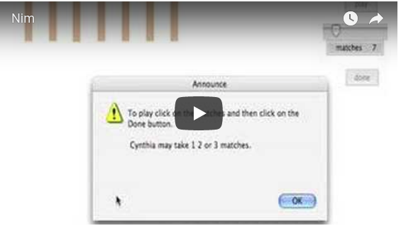
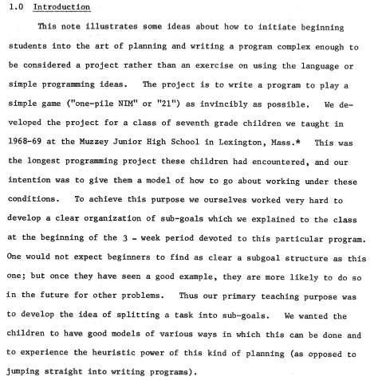
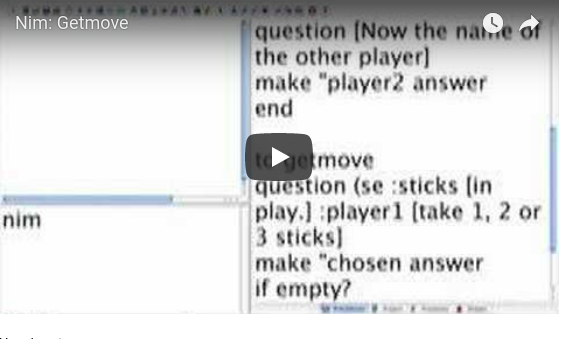
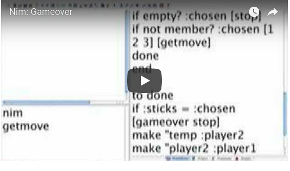

# Nim

## Nim: A game playing program

Here is an example of how the game is played.

Before describing this version of Nim I'm going to describe a version
that does not make use of graphics. It has a place in the Logo history
since it was the first big project we did with kids. You can skip the
history and go immediately to the program description.

## History

About a century ago (just kidding!) Papert and I taught seventh
graders for our first year-long course. We didn’t have turtles; there
were no graphics; we used Model 33 and 35 teletypewriters. I didn't
start out as the seventh grade teacher. A wonderful person began in
the fall; she had very little exposure to Logo as a language and a
culture. I eventually took over the teaching responsibilities and
began collaborating closely with Seymour. From previous observations I
realized that the children had no experience with projects and were
only working on little problems. I also recognized that the kids did
not have to be initiated to every primitive. They would absorb the
language features more quickly on a need to know basis. Nim was our
first project!

I quote from the original paper.

I converted the program so that it runs in PyoLogo. Logo's user
interface has gone through many changes. As the graphics has become
more polished, the programming has become more complicated. This
project exemplifies the changes. Of course, I started off simply and
then kept adding “frills”. More could still be added. Now I’m going to
try to strip it down.

## Nim: Computer as Scorekeeper and Referee

In this version of Nim the computer acts as scorekeeper and
referee. It states the rules, checks that moves are legal and
announces the winner. I've chosen to use 21 sticks in the game.

How do we set the game up?
* We need to get the names of the two players.
* We need to get the first player's move and subtract it from the total number of sticks.
* We need to get the second player's move and subtract it from the total.
* We need to check on whether the game is over.
* We need to repeat the three actions (2 - 4) until a winner can be found.

So far the procedures are:

<pre>
to nim
make “sticks 21
setupgame
end

to setupgame
question [Tell me the name of the first player.]
make "player1 answer
question [Now the name of the other player.]
make "player2 answer
end
</pre>

## Getting a Player's Move

Now we need to get a move from player1.

Here is `getmove`.

<pre>
to getmove
question (se :sticks [sticks are in play] :player1 [take 1, 2 or 3 sticks.] )
make "chosen answer
if empty? :chosen [stop]
if not member? :chosen [1 2 3][getmove]
done
end
</pre>

Continuing to build `getmove` by adding done.

<pre>
to done
If :sticks = :chosen [gameover stop]
make "temp :player2
make "player2 :player1
make "player1 :temp
make "sticks :sticks - :chosen
getmove
end
</pre>

Now announcing the winner

<pre>
to gameover
announce se :player1 [is the winner]
end
</pre>

One more thing is left to do. We need to offer the rules to the players.

<pre>
to announcerules
announce [There are 21 sticks to start. You may remove 1, 2 or 3. The player who takes the last stick wins. This is probably too vague, but try playing and I'll correct your mistakes.]
end
</pre>

But we give the players a chance to refuse receiving the rules.

<pre>
to giveinfo
question [Do you know the rules?]
If answer = "no [announcerules]
end
</pre>

## The Whole Thing

<pre>
to nim
make "sticks 21
setupgame
getmove
end

to setupgame
getinfo
question [Tell me the name of the first player.]
make "player1 answer
question [Now the name of the other player.]
make "player2 answer
end

to announcerules
announce [There are 21 sticks to start. You may remove 1, 2 or 3. The player who takes the last stick wins. This is probably too vague, but try playing and I'll correct your mistakes.]
end

to giveinfo
question [Do you know the rules?]
If answer = "no [announcerules]
end

to getmove
question (se [There are ] :sticks "sticks. char 13 :player1 [ may take 1, 2 or 3 sticks.] )
make "chosen answer
if emptyq :chosen [stop]
if not memberq :chosen [1 2 3][getmove]
done
end

to done
If :sticks = :chosen [gameover stop]
make "temp :player2
make "player2 :player1
make "player1 :temp
make "sticks :sticks - :chosen
getmove
end

to checknum :word
if numberq :word [op :word]
question[Type a proper numeral.]
checknum answer
end

to gameover
announce se :player1 [is the winner]
end

</pre>

## Nim: Computer as Player
