# Turtle Art at the Start

## Turtle Art at OLPC

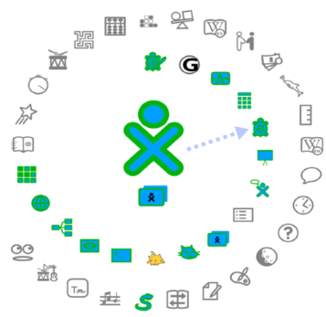

## Meet the Turtle

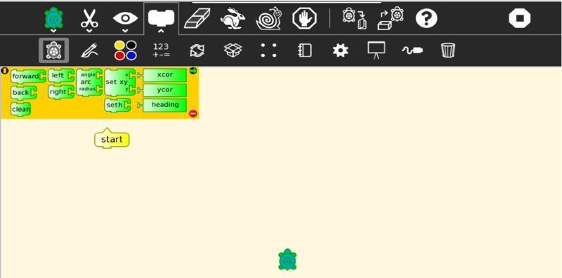

The turtle lives on the computer screen. It has a pen and can leave
marks on the screen.

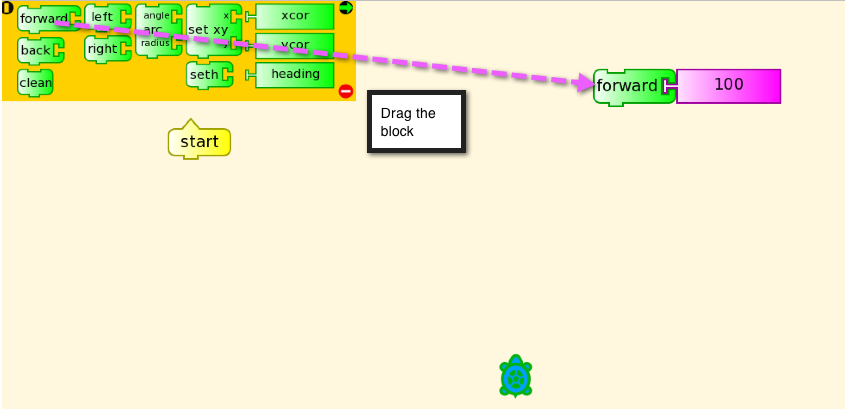

Drag a block anywhere on the canvas. Then click on it and see what happens.

The turtle can go forward or back. It can turn left or right.

The turtle can jump around the screen. You can clean off the
screen. Here we join all the blocks.

## Draw a Square

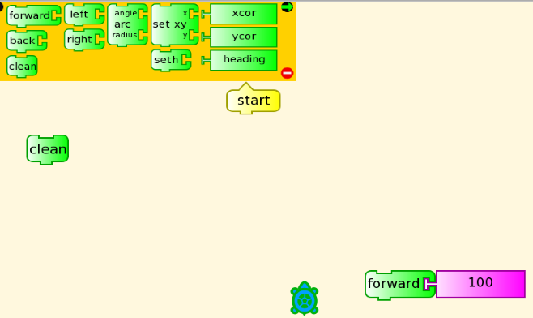

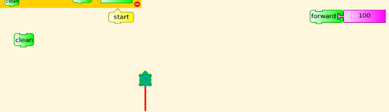

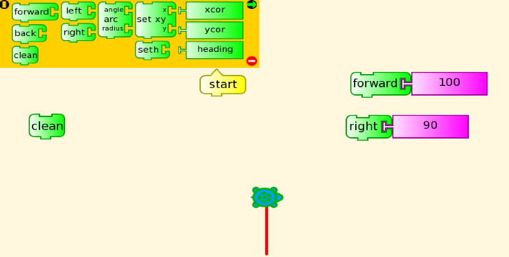

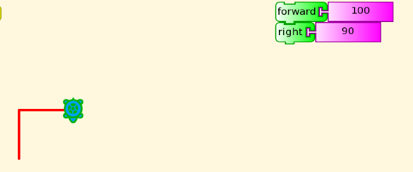

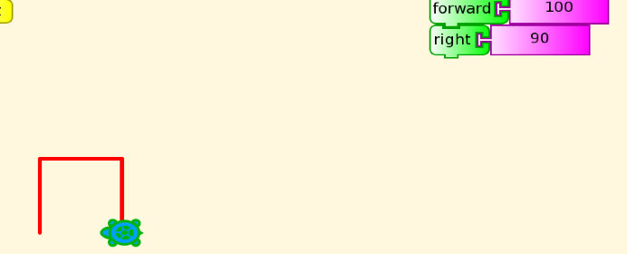

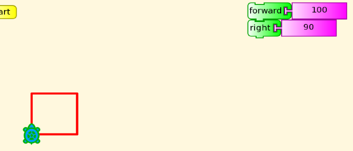

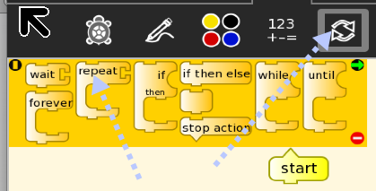

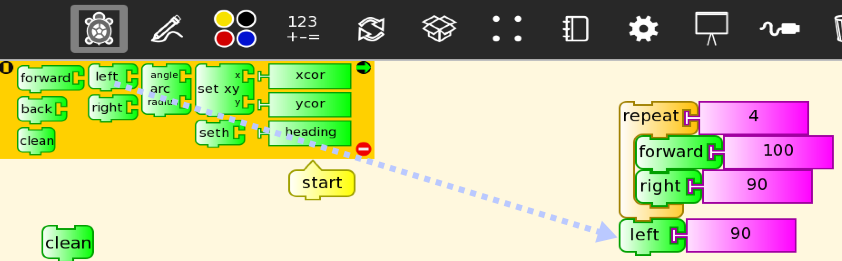

Click
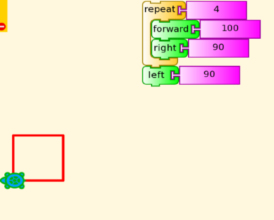

Click
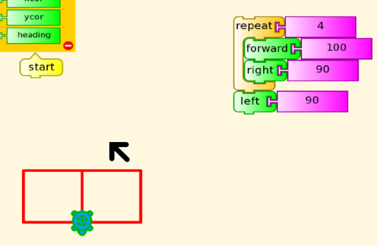

Click
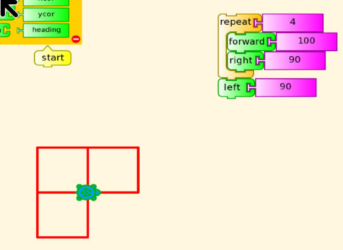

Click
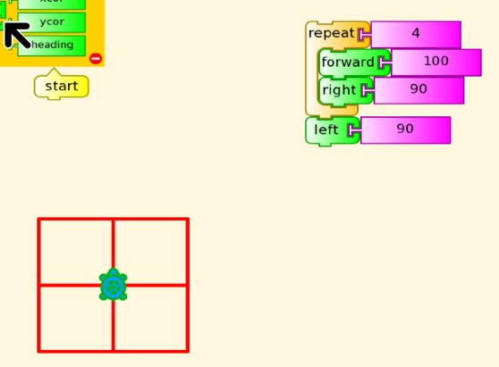

## Name a Stack

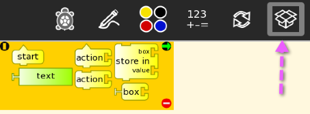

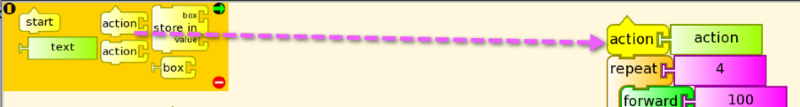

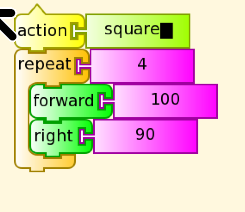

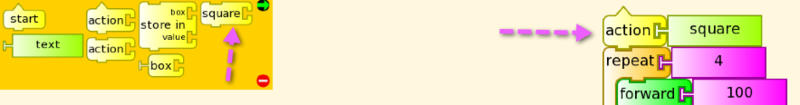

## Using Square

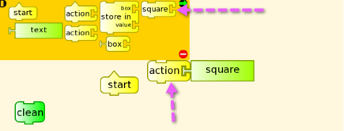

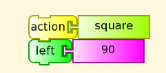

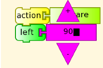

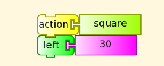

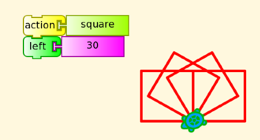

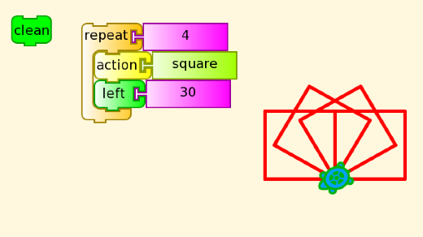
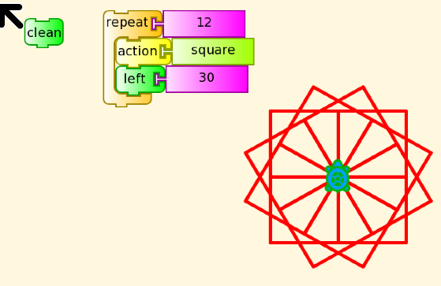

----
[Back to Logo Projects](../LogoProjects.md)
