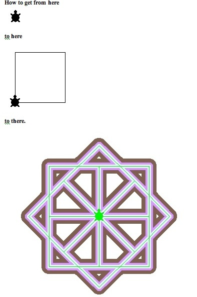
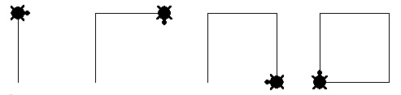
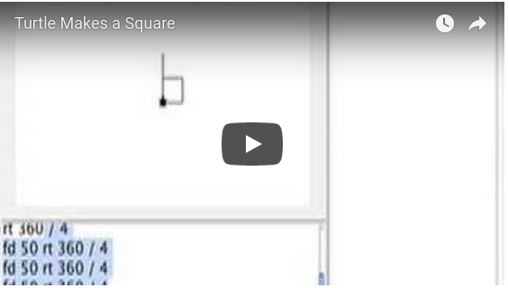
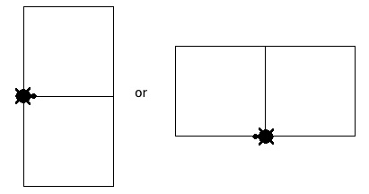
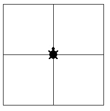
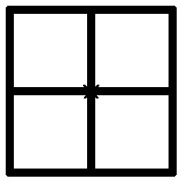
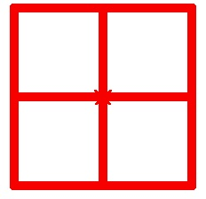
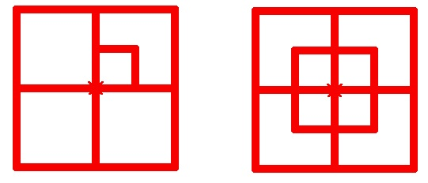
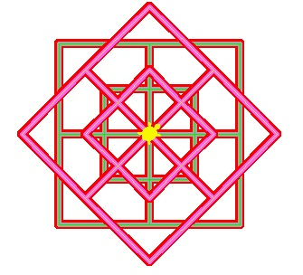
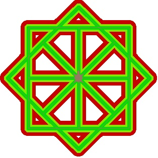

# Polygons Square

## Playing turtle

Let’s get you or someone else to walk in a square like a turtle using
the commands forward and right or left. You know the a feature of
squares is all sides are the same length. Another feature is all
corners are made by turning the same number of degrees.

In walking, we can decide on the number of turtle steps. We can easily
approximate the turning angle if the room we are in is either square
or rectangular. We just turn enough to face the adjoining wall. To
come back to where we started we have to make four turns.

Okay now let’s see how we translate our behavior back to the turtle.

## Playing with Turtle

We can decide on the length of each side by giving the turtle different forward instructions. To see the assorted lengths remember to put the pen down

<pre>
pd
</pre>

then try out different fd instructions

<pre>
fd 5
</pre>

eek! too tiny.

<pre>
fd 20
</pre>

still to small

<pre>
fd 85
</pre>

great!

The amount the turtle turns is not open for discussion. It is constant
and computable. Remember how many degrees we turn to get back to the
same heading as we started. A full circle contains 360 degrees. We
have to complete a full circle in making a square. Remember we turned
the same amount four times. So now we have the solution. We divide 360
(the total amount) by 4 (the number of corners) and the result is 90.

The first part of the turtle’s trip is

<pre>
fd 85 rt 360 / 4
</pre>

and we repeat those instructions three more times.

<pre>
fd 85 rt 360 / 4
fd 85 rt 360 / 4
fd 85 rt 360 / 4
</pre>

Now let’s turn these instructions into one by writing a procedure.

I’ve chosen square as the name, but you can choose another name.

<pre>
to square
</pre>

Now as programmers we can choose how to write the instructions.  For
example we can just copy the four lines and let them be the procedure.

<pre>
fd 85 rt 360 / 4
fd 85 rt 360 / 4
fd 85 rt 360 / 4
fd 85 rt 360 / 4
</pre>

or we could decide to use repeat in the following way:

<pre>
repeat 4 [fd 85 rt 360 / 4]
</pre>

Notice repeat takes two inputs: the number of times an action is to be
done and the action to be taken. The second input is a list and so is
enclosed in square brackets.

To finish the procedure off the final line is

<pre>
end
</pre>

So either

<pre>
to square
fd 85 rt 360 / 4
fd 85 rt 360 / 4

fd 85 rt 360 / 4
fd 85 rt 360 / 4
end
</pre>

or

<pre>
to square
repeat 4 [fd 85 rt 360 / 4]
end
</pre>

should work. But before going any further try your square procedure
out. Check for bugs.

Here is a video of getting the turtle to draw a square.

Later I chose to write the square procedure as

<pre>
to square
repeat 4 [fd 85 rt 360 / 4]
end
</pre>

I tried it by typing into the command center my new instruction.

<pre>
square
</pre>

Aha! I’ve taught Logo a new word.

Applying What I Just Learned.

I can play around a bit with my new procedure.

For example, I could make

What does the turtle do differently in the two designs?

In one the turtle turns right between each square and in the other the
turtle turns left.

Try inventing other designs such as a square that looks like it was
made up of four squares.

Make the turtle draw a large square made out of four smaller squares like

## Applying a Turtle’s Pen Features to Square

A turtle has a position on the screen, a heading, and a pen. The pen
has a color and a size (width). Let’s explore some pen effects.

What’s the widest size the pen can be? (Just try different
numbers until the error message tells you what that number is.)

The pen size is 1 at the start.

<pre>
setpensize 10
</pre>

changes the width to 10 turtle steps wide. The result is

Now let’s change the pen color.

<pre>
setc “red
</pre>

or

<pre>
setc 15
</pre>

<pre>
repeat 4 [square rt 360 / 4]
</pre>

results in

By the way, in my first try at doing this I made the first square
smaller than the other. I didn’t panic. Instead I thought about how I
could use that bug.

The way I did this not take advantage of changing the square procedure
to take an input and thus be able to draw different sized squares.

Here’s what I did:

<pre>
repeat 4 [square rt 90]
repeat 4 [repeat 4 [fd 50 rt 90] rt 90]
</pre>

If I change square to

</pre>
to square :side
repeat 4 [fd :side rt 90]
end
</pre>

then I can say

<pre>
repeat 4 [square 85 square 50 rt 90]
</pre>

I could change the pen color in different places.

A cute trick is to use random. The command, setc, can ber given either
a number or an alphabetic name. Using numbers we can get a new color
randomly. The number of different colors is 256 (0 to 255).

So `setc random 256` is the magic instruction.

And now combining pen color and pen size we can make unusual designs
using square. For example

is one result from running `design2 rt 45 design2`.

<pre>
to design2
setc random 256
setpensize 10
repeat 4 [square1 100 square1 50 rt 90]
setpensize 5
setc random 256
repeat 4 [square1 100 square1 50 rt 90]
setpensize 1
setc random 256
repeat 4 [square1 100 square1 50 rt 90]
end
</pre>

Here is another result from dazzle, the procedure listed below. Enjoy
changing it.

<pre>
to dazzle
pd
setpensize 30
setc random 256
repeat 8 [square 100 rt 45]
setpensize 15
setc random 256
repeat 8 [square 100 rt 45]
setpensize 7
setc random 256
repeat 8 [square 100 rt 45]
setpensize 1
setc random 256
repeat 8 [square 100 rt 45]
end
</pre>

Notice dazzle makes eight squares turning 45 degrees between each square.

