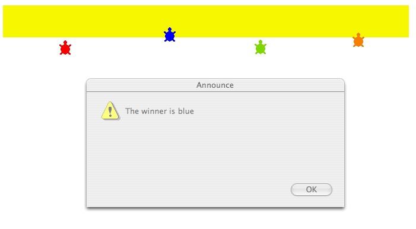

# Race

Here is a turtle race. The turtle that reaches the yellow line first
is the winner.

## To make this game do the following.

Copy the procedures below and paste them into the procedures
area. Draw a yellow finish line.

<pre>
to setup
t1, setpos[-236 -130 ]
setc "red
t2, setpos[-60 -130 ] setc "blue
t3, setpos[ 93 -130 ] setc "green
t4, setpos[258 -130 ] setc "orange
end

to race
setup
forever [ask [t1 t2 t3 t4] [fd 2 + random 6 wait 1]]
end

to winner :turtle

to :turtle
announce se [The winner is ] colormatch
stopall
end

to colormatch
if who = "t1 [op "red]
if who = "t2 [op "blue]
if who = "t3 [op "green]
if who = "t4 [op "orange]
end
</pre>

