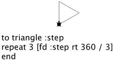
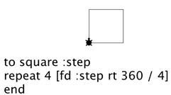
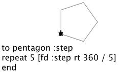
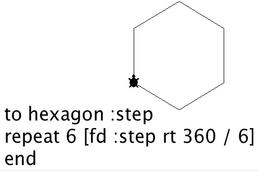
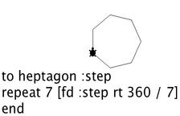
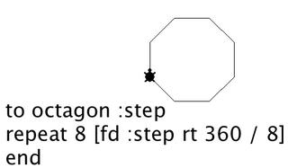
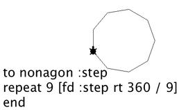
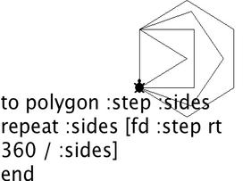
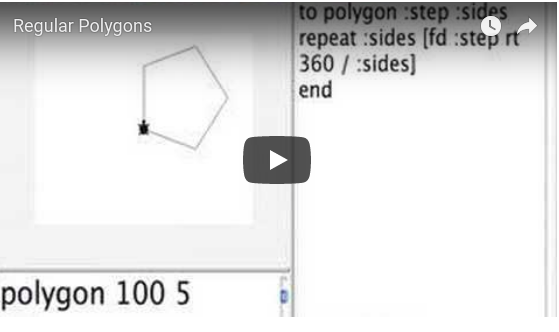

# Regular Polygons

## What's a regular polygon?

Squares are regular polygons. Certain triangles are regular. The sides
are all the same and the angles are all the same.

A regular polygon is also a pentagon, a hexagon, a heptagon, an
octagon, a nonagon. It is a closed shape made up of straight lines
connected by corners or vertices (vertex). All the lines are the same
length and all the corners are the same number of degrees. The lines
don't cross one another.

Here is another look at regular polygons.

