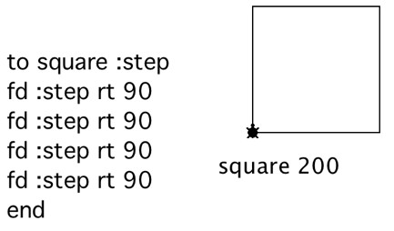
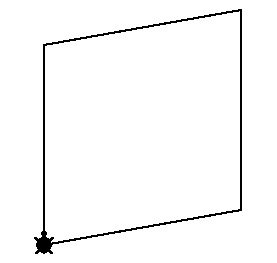
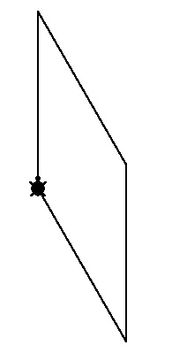
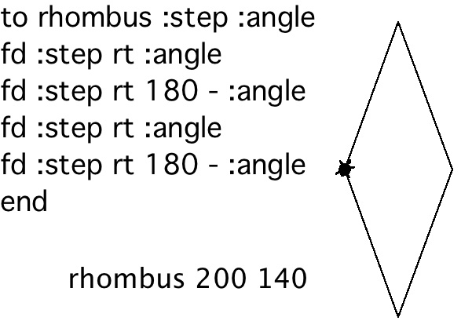

# Squashed Squares

Have you got a favorite shape? Well, I do; and it’s a squashed
square. “What’s that!” you might ask. In math a squashed square is
called a rhombus. Let’s explore squashing a square.

Here’s a square. The procedure takes one input, which is the number of
turtle steps for each side. As you know squares are regular polygons;
all their sides are the same.

That's a nice square, but let's squash it. To squash a square and make
a rhombus, we need to change the amount the turtle turns at each
corner or vertex. It can't be 90. Here is one rhombus with only a
slight change in angle and another with a more extreme difference in
angle.

Notice that opposite angles are the same. So there are only two
different angles in the figure. Each half of the figure is the same.

Since each half is the same we can divide the job into two parts. We
know a total turtle trip for a polygon is 360 degrees. After half of
the trip the turtle has turned `360 / 2` or 180 degrees. So this is the
clue to solving the problem.  The largest turtle turn has to be less
than 180 degrees.

Knowing one angle we can compute the other by subtracting it from 180.

As you can see the procedure takes two inputs: the length of the side
and the turtle's rotation at one vertex. In the image above the turtle
turns an angle of 140 degrees at the first corner and 180 -140 or 40
degrees at the next corner and then repeats those two turns.

I did a sneaky thing and turned the turtle `40 / 2` at the start so that
the figure looks erect!

TO BE CONTINUED!
