# Squiggling

## Making Squiggly Lines

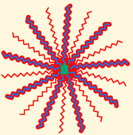

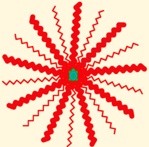

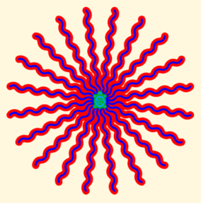

I like making squiggly lines and using them as spokes.

## Here are some squigglys. Experiment and make more.

Look at these squigglys.

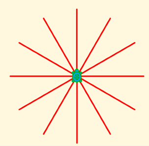

Made with straight line squiggles.

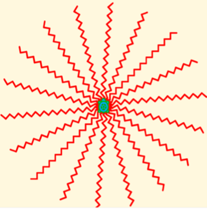

Made with zigzag squiggles.

## Curvy Squigglys looked easy. I struggled to get basic s curve.

I got

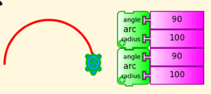

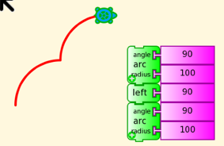

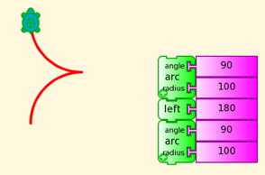

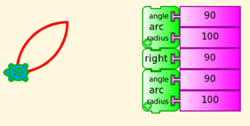

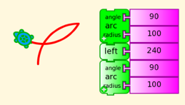

I decided to play with

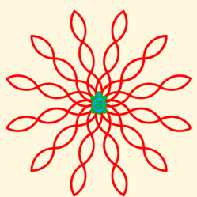

## [Curvy Squiggling](CurvySquiggling.md)

Finally my friend showed me how to get the S-curve.

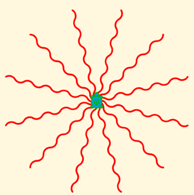

## [S-Curve Squigglys](SCurveSquigglys.md)
