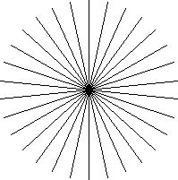
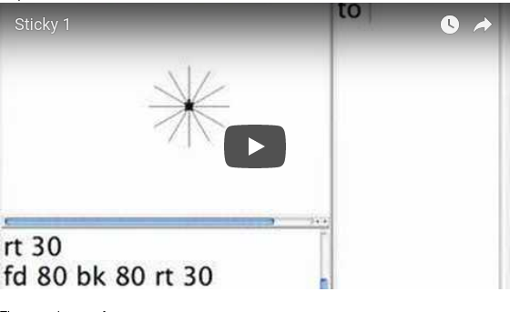
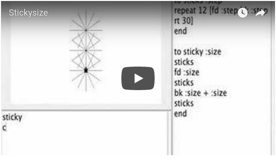
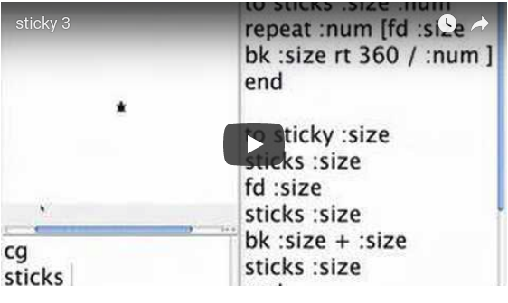
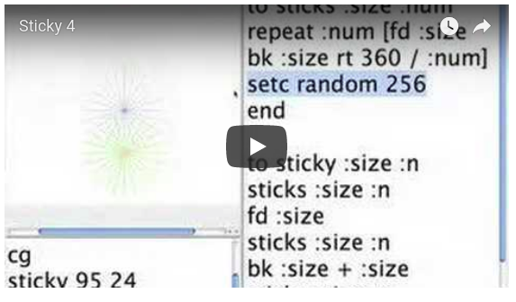
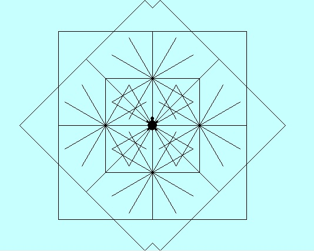

# Sticks

## Sticks: A Lesson in Turtle Geometry

I want to make designs like:

or

Here's one way I did it. You can find other ways as well.

Step 1

The procedures so far are:

<pre>
to sticks
repeat 12 [fd 80 bk 80 rt 30]
end

to sticky
sticks
fd 80
sticks
bk 80 + 80
sticks
end
</pre>

To actually reproduce the images above there are at least three things
the turtle needs to learn to do.

1. Draw longer sticks.
2. Draw more sticks around the circle.
3. Draw sticks in different colors.

Let's look at the procedure, sticks. The inputs to forward and back
influence the length of sticks. What about the other two numbers?
Repeat uses 12 to control how many times the list of instructions is
done. 30 is how much the turtle turns at each round. These two numbers
are really related to one another. If the number of degrees changes
then the number of times the instructions need repeating to make a
full circle will also change.

Draw Longer Sticks

Draw More Sticks

<pre>
Reminder: 12 * 30 = 360 or 360 / 30 = 12 or 360 / 12 = 30
</pre>

And 360 is the number of degrees in a circle.

Draw Sticks in Colors

## A Version from an 8-year Old

### And the Procedures

The new procedures are runcard, master, circle and box.

The procedure, runcard, presents different elements before the final design.

<pre>
to runcard
setbg 81
cg
circle
wait 3
cg
stick
wait 3
cg
sticky
wait 3
cg
master
end
</pre>

<pre>
to master
sticky
repeat 8 [box]
end

to box
repeat 4 [fd 160 lt 90]
lt 45
end

to circle
pd
repeat 36 [lt 10 fd 10]
end
</pre>
