# The Shed School

The Shed School Project

This [album](http://www.bubbleshare.com/album/175477) is powered by
[BubbleShare](http://www.bubbleshare.com/) - [Add to my
blog](http://www.bubbleshare.com/album/175477/share#add_to_blog)

The Shed School Project happened over a two-week period during a
summer. After the two weeks the children had produced a short video
you can view here. The project is a collaborative mixed-media
theatrical event. Kids choose a story to perform. In the following
example the group including adults and kids chose the story of
Daedalus, Icarus, the minotaur and Ariadne, who was the daughter of
King Minos. The students were called upon to write a script and debug
and elaborate on the dialog as they proceeded to test out its
coherence in rehearsals and actual performances which were captured by
digital cameras. The students designed and put together the costumes,
sets and properties. The adults were music, arts and crafts and
computer teachers. We met every day for two weeks devoting the entire
day to the project. Students would use a variety of software including
MicroWorlds, KidPix, HyperStudio, Garageband, iMovie, Audacity, Word
and so on.

As a reference we used Jane Yolen’s book, Wings.

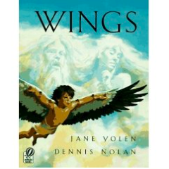

Some of the work was done on a computer and some was done in the art
studio and some in playrooms or the great outdoors. The students did
most of the script development and music creation in the evenings
without adult help. During the day the adults would consult with the
students in specific areas and in overall shaping of the story. The
adults helped the students to modify and divide up the project into
executable components.

We met for group discussions twice a day. In the morning we discussed
goals for the day and how we might divide up time. At the end of the
day we discussed our accomplishments, difficulties, and plans for the
next day.

In our first group discussion we decided to make puppets for some of
the characters in the story and to be some of the characters in the
story. To get an immediate sense of managing the puppets and editing
the video we began with already built puppets. We set up a stage
outside and the video camera.

Because the children were shy at first and reticent to perform, it was
important to start them out right away of performing and then viewing
their performances.

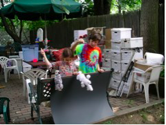

Getting ready with puppets

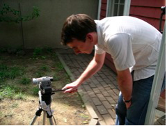

Setting up the camera

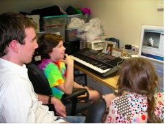

Looking at the results

We discussed our story a lot to decide what would be portrayed and in
what medium.

The decisions immediately arrived at were:

1. Daedalus and Icarus would be actual people in costume

2. We needed a female character and since Ariadne was vital to the
   story we wanted to use her. Again she would be played by a person not
   a puppet.

3. The minotaur was necessary too.

4. We needed music. For this we had both HyperScore and Garageband.

We decided on making two puppets, Ariadne and Daedalus.  We also
decided to make a set of wings for the person playing Daedalus.

We were going to use the computer to plan puppets, create music, fill
in parts of the story, editing the video and creating the narrations.

## Making feathers, puppets and music

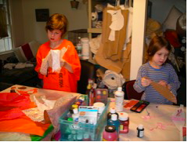

In the studio

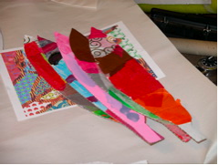

A close up of feathers

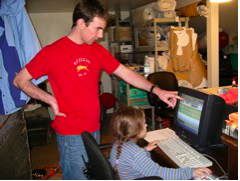

Debugging in HyperScore

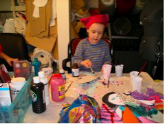

Fixing Ariadne

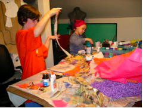

Back at the work table

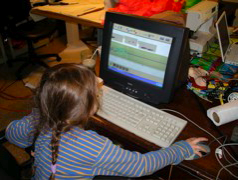

More HyperScore work

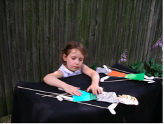

Finishing Ariadne

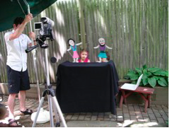

Setting up the camera

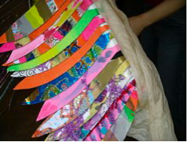

Closer look at a wing

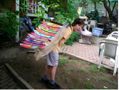

Testing the wings

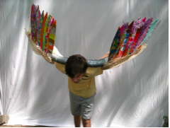

Flying

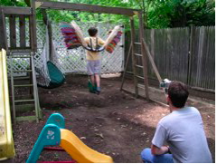

## Sound Effects and Music Compositions

Icarus falling: sound effect

[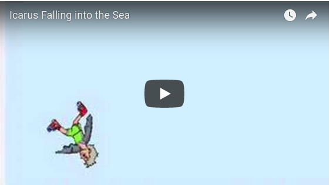](https://youtu.be/PgHNg3M4EV8)

The Theme Song: original song

[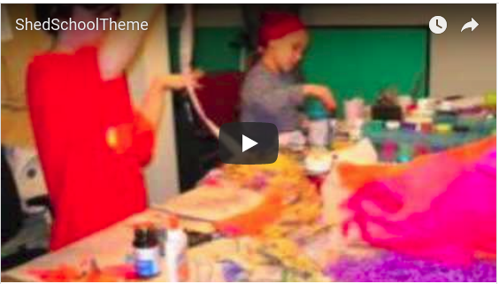](https://youtu.be/dJBidtaR9Ws)

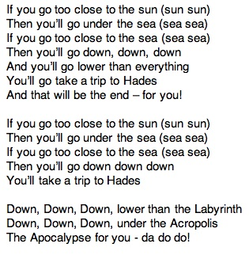

----

After two weeks of intensive preparation everything was assembled for
a performance evening. The movie was shown on the outdoor screen,
i.e., a white bed sheet.

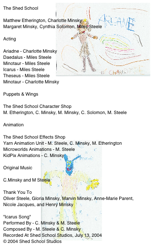

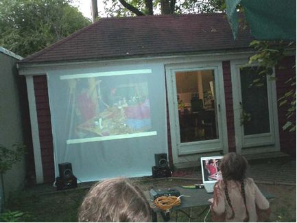

After much applause the students faced the audience for a lively
question period. This interaction was a highlight of the project. The
students were surprisingly poised and thoughtful in their
answers. Afterwards, they got a chance to show individual attendees
how they made music and animations. They also showed how they knit
everything together.

----

[Back to Logo Projects](../LogoProjects.md)
