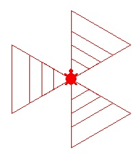
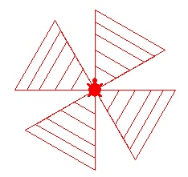
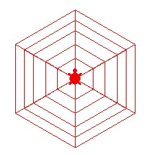
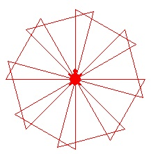
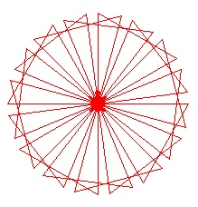
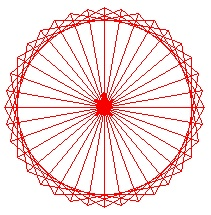
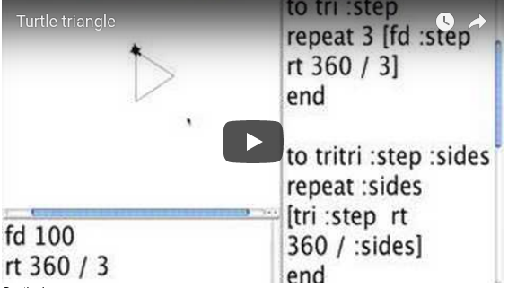

# Tri-agons

This design is created by a procedure called tritri (of course, you
could choose a different name). How does tritri do it? What about
these:

The name hints at the answer.Triangles are involved. So a good place
to start is to make a procedure that will get the turtle to draw a
triangle.

Playing turtle, that is, walking as a turtle would to make a triangle
is a good way to start. As you play turtle the big issue arises. Is
the triangle to have equal angles? If the triangle has equal angles
like a square it would also have equal sides.

Remember when you begin a "turtle trip" you go through 360 degrees (or
a multiple of 360) to return to your starting place. Thus making a
triangle is like making a square except the rotations at the corners
and the number of sides are different. The technical name for corner
is vertex.

Continuing on ...

and more ...

