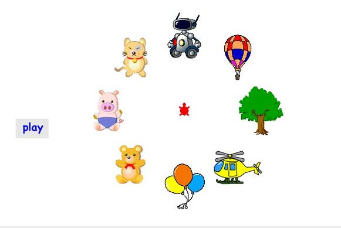
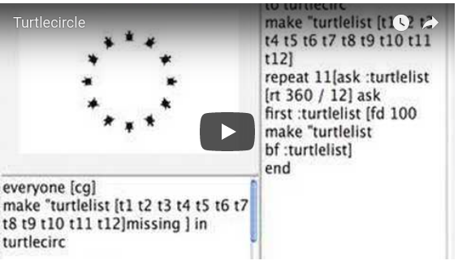
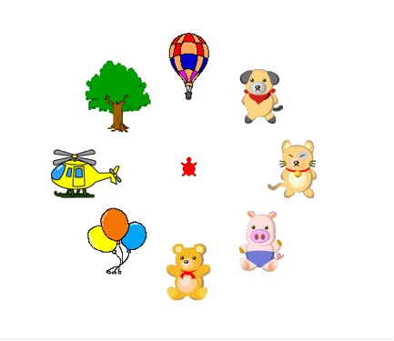

# Turtles in a Circle

## Seating turtles around a circle

My first challenge here was to figure out how to put turtles in a
circle. I wanted them evenly spaced from the circle's center and along
its rim or perimeter.  Here's how I did it.

## Dressing the Turtles Up

I wanted to have turtles in different costumes perched on the
perimeter of a circle. A red turtle was to remain in the center along
with a hidden ball. In the final project there were an assortment of
turtles `[t2 t3 t12 t5 t6 t24 t10 t9 t1 t8 t24]`. Two stayed in the
center (`t2` and `t24`) and the rest (`t3 t12 t5 t6 t24 t10 t9 t1 t8`)
were to be placed on the perimeter. The red turtle, t2, was to remain
visible all the time. The ball, `t24`, was to remain in the center
hidden until the red turtle "threw" it.

To prepare, put all the turtles in the center.

<pre>
ask [t2 t3 t12 t5 t6 t24 t10 t9 t1 t8 t24][cg pu]
</pre>

Give each turtle its costume.

<pre>
t24, ht setsh "soccerball
t3, setsh "balloon
t12, setsh "tree2
t5, setsh "helicopter4
t6, setsh "balloons
t10, setsh "teddybear
t9, setsh "teddypig
t1, setsh "teddycat
t8, setsh "teddydog
</pre>

Now turn the job of putting the turtles in their respective places
over to another procedure. Notice the list does not include `t2`, the
red turtle, nor `t24`, the ball.

<pre>
turtlecirc [t3 t12 t5 t6 t10 t9 t1 t8]
end
</pre>

<pre>
to turtlecirc :turtlelist
make "num count :turtlelist
ask :turtlelist [cg]
repeat :num [ask :turtlelist [rt 360 / :num] ask first :turtlelist [fd 100 setc random 256 ]make "turtlelist bf :turtlelist]
end
</pre>

I made `turtlecirc` more readable by creating a subprocedure for
handling all the instructions being repeated.

<pre>
to turtlecirc :turtlelist
make "num count :turtlelist
ask :turtlelist [cg]
repeat :num [tc.helper]
end

to tc.helper
ask :turtlelist [rt 360 / :num]
ask first :turtlelist [fd 100 setc random 256 ]
make "turtlelist bf :turtlelist
end
</pre>

As I started using turtlecirc I changed it a bit. I gave turtlecirc an
input so that I could setup the circle of turtles in different places
on the screen.

<pre>
to turtlecirc :turtlelist :position
make "num count :turtlelist
ask :turtlelist [setpos :position seth 0]
repeat :num [tc.helper]
end
</pre>

Now I have turtles in a circle. I can do different things. My first
project was a game in which a player controls the red turtle’s heading
by using the left and right arrow keys. Then by pressing the space the
player is asked how many steps the turtle takes. If the aim is good
and the step estimate is good then the object on the circle changes
shape. The player continues until all ring objects have changed.