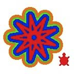
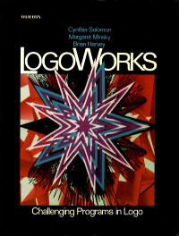

# LogoWorks: Challenging Programs in Logo

edited by
Cynthia Solomon, Margaret Minsky and Brian Harvey

The book has been out of print for a while, but now here it is. The
programs are written in Atari Logo by a collection of Logo enthusiasts
who hung out at the Atari Cambridge Research Lab. Except for the
animation projects most of the programs will run in current versions
of Logo.

## Contents

 [Front Matter, Table of Contents](front.pdf)

 [Preface - Marvin Minsky](preface.pdf)

 [Contributors - Introduction - Acknowledgements](intro.pref.pdf)

1.  [Wordplay](Section1.pdf)

2.  [Stories](Section2.pdf)

3.  [Games](Section3.pdf)

4.  [Turtle Geometry](Section4.pdf)

5.  [Music](Section5.pdf)

6.  [Programming Ideas](Section6.pdf)

 [Appendix](appendix.pdf)

----

[Back to Books and Papers](../Books.md)

[Back to Home Page](../Home.md)
